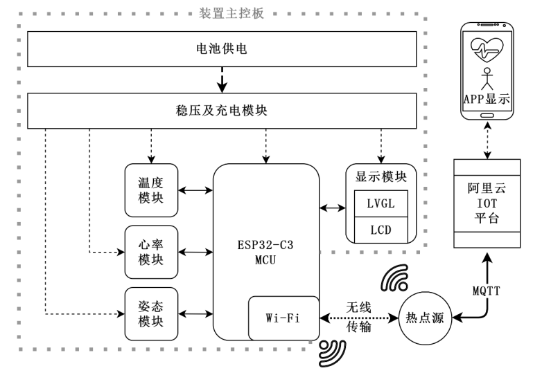
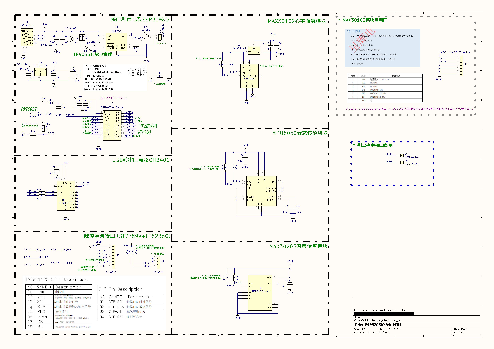
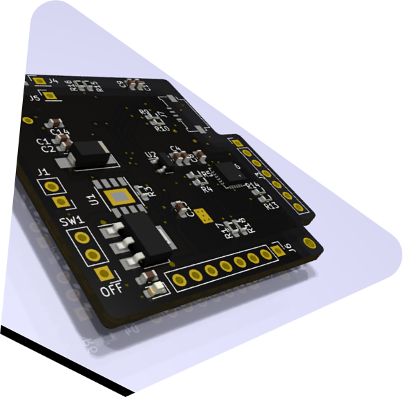
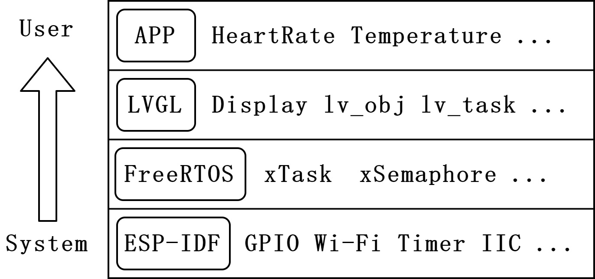
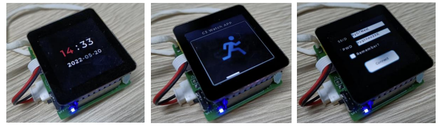
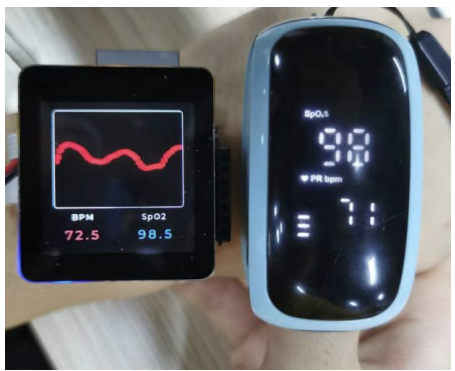

# ESP32C3Watch
## 1. Brief/简介
The smartwatch made based on ESP32-C3(RISC-V MCU),Which has heart rate, oximetry, temperature, fall detection and IOT Function. 

> 基于 ESP32-C3的智能手表（RISC-V MCU），具有心率、血氧饱和度、温度、跌倒检测和物联网功能。

The project stems from My Graduation Project in 2022, Since the time for secrecy has ended, I can open source its design and code.The project may be very old, some components and functions can not be used directly, need to be adjusted according to the latest library, please be aware of.

> 该项目源于2022年的毕业设计，因为已满足时间，所以开源其设计与代码。该项目可能比较旧了，有些组件和函数不能直接使用，需要根据最新的库进行调整，请悉知。

Here are the folder descriptions:
1. HardWare: used to store hardware related, circuit design and PCB design, using KiCAD for the design of the project; also contains 3D models and peripherals DataSheet.
2. Software: used to store the programme code of CMU master control, this project uses ESP-IDF (LVGL library) of VScode environment to build the project, the version may be very old.
3. Article: thesis and reference materials.
4. images: README.md needed images.

> 以下是文件夹说明：
> 1. HardWare：用于存放硬件相关，电路设计及PCB设计，使用KiCAD进行设计的工程；还包含3D模型及外设DataSheet。
> 2. Software：用于存放CMU主控的程序代码，该项目使用VScode环境的ESP-IDF(LVGL库)进行工程建立，版本可能很旧了。
> 3. Article：论文及参考资料。
> 4. images：README.md 需要的图片。

## 2. Architecture/架构：

In view of foreign chip design enterprises may take the technology monopoly, coupled with the COVID-19 has made people pay more attention to a healthy life. This topic designed a wearable human health monitoring device based on RISC-V architecture MCU, which can detect the wearer's heart rate, blood oxygen saturation, skin surface temperature, and exercise status in real-time. After scheme comparison, the ESP32-C3 series of Espressif Systems CO., LTD. was selected as the master chip. The MAX30102 sensor was used to obtain photoplethysmogram(PPG) signals, which can calculate heart rate and blood oxygen saturation(SpO2) data. MAX30205 was used to obtain real-time temperature, and MPU-6050 Inertial measurement unit(IMU) was used to obtain motion state data, so as to realize the functions of sedentary and falling reminder.

A GUI interface based on LVGL allows users to interact with the device and view data, ifconnected to a Wi-Fi hotspot, it will upload data to the AliCloud IOT server via MQTT. Through the AliCloud data visualization platform, users can view historical data and fall alarm information by using the supporting APP.

After finishing the design, the device defects were found and optimized through various 
functional tests. Finally, good stability of the device and accuracy of data was realized.

> 鉴于国外芯片设计企业可能采取的技术垄断，加之疫情让人们对健康生活更加重视，本课题设计了一款基于 RISC-V 架构 MCU 的穿戴式人体健康监测装置，可实时检测佩戴者的心率和血氧饱和度、皮肤表面温度以及运动状态等健康参数。经过方案比对，最终选择乐鑫科技的 ESP32-C3 系列作为主控芯片，使用 MAX30102 传感器获取光电容积脉搏波（PPG）并计算心率、血氧饱和度(SpO2)数据，通过 MAX30205 获取实时温度、MPU-6050 惯性测量单元(IMU)获取运动状态数据，从而实现久坐、跌倒提醒等功能。

> 用户可通过基于 LVGL 设计的 GUI 界面进行人机交互、数据查看，还可将装置连接至 Wi-Fi 热点，数据会通过 MQTT 协议上传至阿里云 IOT 服务器。借由阿里数据可视化平台，用户端可使用配套 APP 查看历史数据、跌倒警报信息等。

> 装置设计完成后，通过各项功能测试，发现存在设计缺陷并进行了改正及优化，最终实现了装置的稳定与数据的准确可靠。

## 3. Schematic/原理图

For a detailed description, please see the Article/ESP32C3Watch_CN.pdf

> 详细的介绍请见文件 Article/ESP32C3Watch_CN.pdf

## 4. PCB

The PCB is just used as a reference, it can actually be made better and smaller. For a detailed description, please see the Article/ESP32C3Watch_CN.pdf

> PCB只是作为一个参考，实际上它可以做得更好、更小巧。详细的介绍请见文件 Article/ESP32C3Watch_CN.pdf

## 5. Function/功能

For a detailed description, please see the Article/ESP32C3Watch_CN.pdf

> 详细的介绍请见文件 Article/ESP32C3Watch_CN.pdf

## 6. Display results/结果展示

For a detailed description, please see the Article/ESP32C3Watch_CN.pdf

> 详细的介绍请见文件 Article/ESP32C3Watch_CN.pdf
